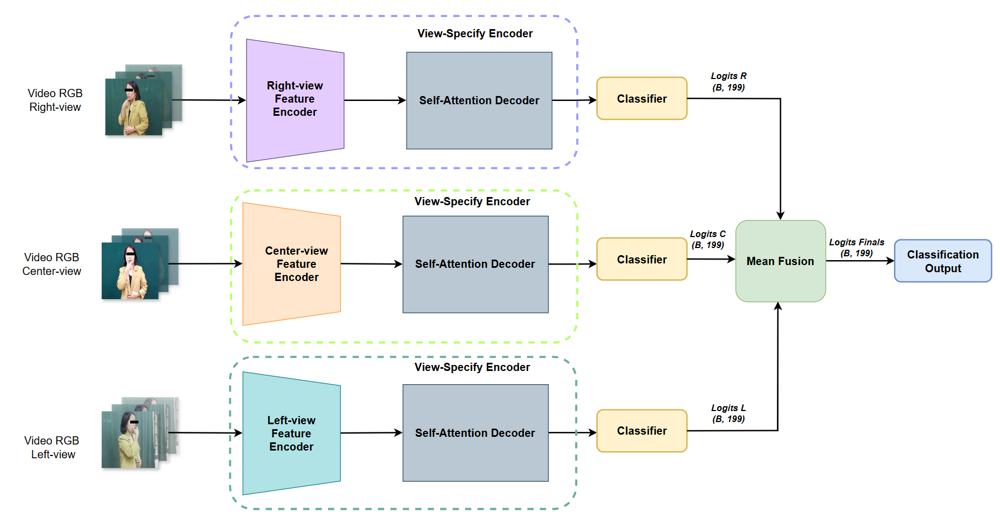
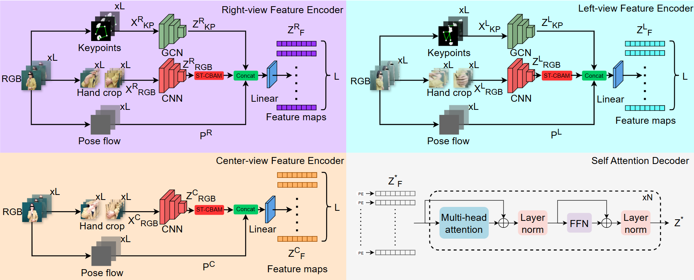
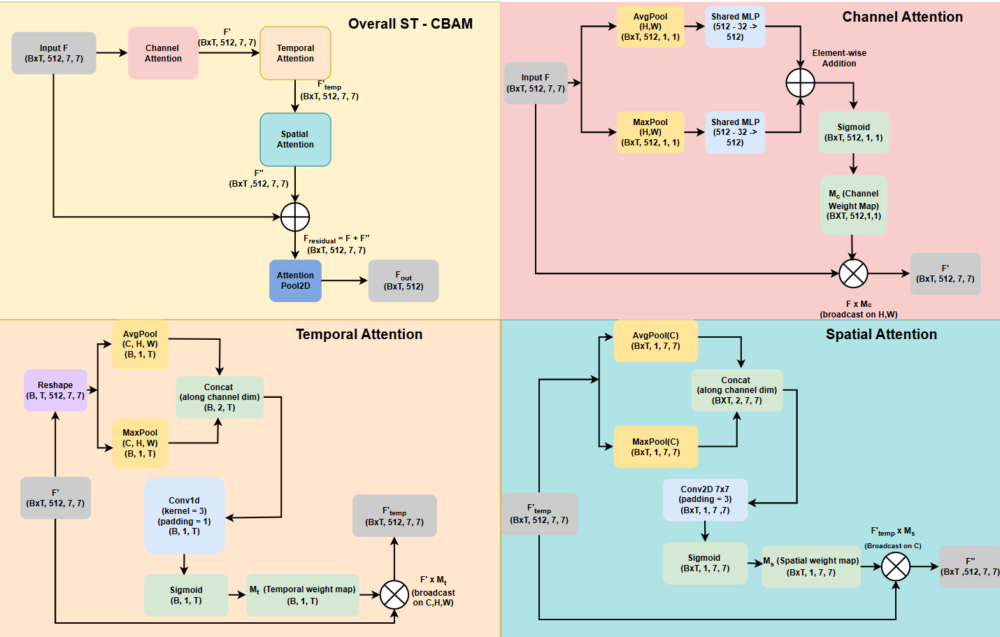

# VTN3GCN: Multi-View Multi-Stream Sign Language Recognition

> **VTN3GCN: Enhancing Sign Language Recognition Through Multi-View and Multi-Stream Integration**
> IEEE Access (Under Review)

## Overview

With over 70 million deaf individuals worldwide relying on sign language, automated Sign Language Recognition (SLR) systems are critical for bridging the communication gap. Most existing SLR systems rely exclusively on frontal-view data, limiting real-world generalizability.

We propose **VTN3GCN**, a multi-view multi-stream framework that jointly integrates RGB data, skeleton keypoints, and pose flow from **three synchronized viewpoints** (left ~45°, center ~0°, right ~45°). The framework augments the Video Transformer Network (VTN) backbone with a sequential **Spatio-Temporal CBAM (ST-CBAM)** and adaptive **AttentionPool2D**, combined with view-specific **AGCN** branches and an optimized **Late Average Fusion** strategy.

<p align="center">
  
  <br><em>Figure 1: Overall VTN3GCN pipeline with Late Average Fusion and Late Weighted Fusion variants.</em>
</p>

<p align="center">
  
  <br><em>Figure 2: View-Specific Encoder architecture for Center, Left, and Right views.</em>
</p>

---

## Key Contributions

- **Multi-View Multi-Stream Architecture**: Integrates RGB, AGCN skeleton features, and Pose Flow from 3 viewpoints with view-specific encoder designs.
- **ST-CBAM + AttentionPool2D**: Sequential channel, temporal, and spatial attention augmentation after the CNN backbone, with adaptive multi-head attention pooling.
- **Late Average Fusion**: Decision-level ensemble that maintains independent classifier heads per view, preventing cross-view feature space corruption.
- **Robustness Analysis**: Comprehensive experiments under Gaussian pose noise and multi-view data loss scenarios.

---

## Results

### State-of-the-Art Comparison on Multi-VSL200

| Method | View | Top-1 Acc. (%) | Top-5 Acc. (%) |
|--------|------|----------------|----------------|
| I3D | 1-view | 56.62 ± 0.55 | 83.99 ± 0.63 |
| I3D | 3-view | 66.35 ± 0.66 | 90.14 ± 0.50 |
| Video Swin Transformer | 1-view | 77.29 ± 0.83 | 91.81 ± 0.64 |
| Video Swin Transformer | 3-view | 82.33 ± 0.34 | 94.03 ± 0.32 |
| MViTv2 | 1-view | 81.57 ± 0.38 | 92.36 ± 0.29 |
| MViTv2 | 3-view | 86.45 ± 0.26 | 95.55 ± 0.31 |
| VTNPF | 1-view | 81.64 ± 0.52 | 92.29 ± 0.37 |
| VTNPF | 3-view | 87.99 ± 0.51 | 95.50 ± 0.17 |
| **VTN3GCN (Ours)** | **3-view** | **93.16 ± 0.35** | **98.41 ± 0.17** |

### Cross-Dataset Evaluation (3 Views)

| Fusion Method | MultiVSL200 (%) | MultiVSL400 (%) | Params (M) |
|---------------|-----------------|-----------------|------------|
| Concatenation | 92.69 ± 0.21 | 95.36 ± 0.15 | 10.68 |
| Cross-Attention | 92.43 ± 0.34 | 94.91 ± 0.28 | 19.08 |
| Late Weighted Fusion | 93.06 ± 0.26 | 95.19 ± 0.22 | 4.38 |
| **Late Average Fusion (Ours)** | **93.16 ± 0.35** | **95.40 ± 0.14** | **4.38** |

### Computational Efficiency (RTX 3090, T=16, batch=1)

| Component | Params (M) | FLOPs (G) | Latency (ms) | FPS |
|-----------|-----------|-----------|--------------|-----|
| Center Stream | 52.88 | 118.82 | 16.21 | 61.7 |
| Left Stream | 56.98 | 119.74 | 20.95 | 47.7 |
| Right Stream | 56.98 | 119.74 | 20.95 | 47.7 |
| Fusion Head | 10.06 | 0.0101 | 0.08 | 12,323.1 |
| **Total Pipeline** | **176.89** | **358.32** | **39.13** | **25.6** |

---

## Dataset

**Multi-VSL200** is the first multi-view Vietnamese Sign Language dataset, collected in collaboration with 28 volunteers (teachers and hearing-impaired students from Hanoi School for the Deaf).

- 18,981 videos, 199 glosses, 3 synchronized viewpoints
- Resolution: 1920×1080 → resized to 224×224
- 30 FPS, signer-independent train/val/test split (20/4/4 signers)
- 📦 [Download Dataset](https://drive.google.com/drive/folders/1yUU1m2hy_CjaXDDoR_6i9Y3T1XL2pD4C)
- Labels: [`data/`](data/)

**Multi-VSL400** (cross-scale evaluation): 400 classes, ~24,753 samples.

---

## Architecture Details

### ST-CBAM + AttentionPool2D

<p align="center">
  
  <br><em>Figure 3: ST-CBAM pipeline — Channel, Temporal, and Spatial Attention modules.</em>
</p>

Given feature map $F \in \mathbb{R}^{(B \times T) \times C \times H \times W}$ from ResNet34 ($C=512, H=7, W=7$):
1. **Channel Attention**: MLP-based squeeze-and-excitation (512→32→512)
2. **Temporal Attention**: 1D conv (k=3) across frame dimension
3. **Spatial Attention**: 2D conv (7×7) on spatial dimensions
4. **AttentionPool2D**: 4-head attention pooling replacing global average pooling

### Keypoints Graph

46 keypoints extracted via RTMPose: 21 per hand + 2 shoulders + 2 elbows.

---

## Installation

```bash
# Clone repository
git clone https://github.com/Vietanh2304/VTN3GCN_CBAM.git
cd VTN3GCN_CBAM

# Install dependencies
pip install -r requirements.txt
```

---

## Usage

### Stage 1 — Train Single-View Backbones

```bash
# Center view (VSL199)
python main.py --config configs/Stage1_SingleView/Stage1_Center_VSL199.yaml

# Left + Right views sequentially
bash scripts/run_left_then_right.sh

# VSL400
python main.py --config configs/Stage1_SingleView/Stage1_Center_VSL400.yaml
```

### Stage 2 — Extract Features

```bash
# VSL199
python scripts/extract/extract_features.py

# VSL400
python scripts/extract/extract_features_vsl400.py
```

### Stage 2/3 — Train Fusion Models

```bash
# Stage 2: all pairwise combinations (12 configs)
bash scripts/run_all_fusion.sh

# Stage 3: full 3-view fusion (4 configs)
bash scripts/run_all_fusion_stage3.sh

# Multi-seed evaluation (5 seeds)
bash scripts/run_5_seeds.sh
```

### Evaluation

```bash
# 10x temporal sampling evaluation
python analysis/eval_fusion_10x.py

# Pose noise robustness study
python analysis/eval_noise_robustness.py

# View results summary
python analysis/summary.py
```

---

## Project Structure

```
VTN3GCN_CBAM/
├── main.py                          # Stage 1 training entry point
├── train_fusion.py                  # Stage 2/3 fusion training
├── AAGCN/                           # Adaptive Graph Convolutional Network
├── configs/
│   ├── Stage1_SingleView/           # YAML configs for VSL199 & VSL400
│   └── VTNGCN/                      # Legacy VTNGCN configs
├── dataset/                         # Dataloaders
├── modelling/
│   ├── vtn_att_poseflow_model.py    # VTNHCPF & VTNHCPF_GCN (with ST-CBAM)
│   ├── cbam_modules.py              # ST-CBAM, AttentionPool2D
│   └── fusion_models.py             # Fusion classifiers (concat, crossattn, GMU, late)
├── trainer/                         # Training & evaluation logic
├── utils/                           # Config loader, augmentation
├── tools/                           # Preprocessing (pose, poseflow, keypoints)
├── scripts/
│   ├── extract/                     # Feature extraction scripts
│   ├── run_all_fusion.sh            # Stage 2 full run
│   ├── run_all_fusion_stage3.sh     # Stage 3 full run
│   ├── run_5_seeds.sh               # Multi-seed reproducibility
│   └── run_left_then_right.sh       # Sequential Stage 1 training
├── analysis/                        # Evaluation & visualization scripts
│   ├── eval_fusion_10x.py           # 10x temporal sampling eval
│   ├── eval_noise_robustness.py     # Pose noise stress test
│   ├── run_qualitative_analysis.py  # Failure case + attention viz
│   ├── make_figure6.py              # Paper Figure 6 generation
│   ├── measure_efficiency.py        # FLOPs / latency benchmark
│   └── summary.py                   # Results leaderboard
├── data/                            # CSV label files
└── images/                          # Architecture figures
```

---

## Citation

```bibtex
@article{vtn3gcn2025,
  title   = {VTN3GCN: Enhancing Sign Language Recognition Through Multi-View and Multi-Stream Integration},
  author  = {...},
  journal = {IEEE Access},
  year    = {2025}
}
```

---

## Acknowledgments

Data collected in collaboration with Hanoi School for the Deaf. Faces blurred for privacy.